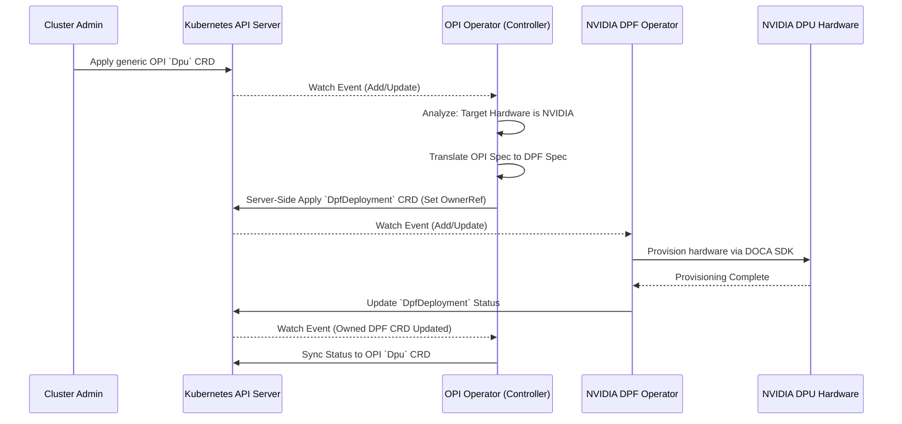

# Architecture Design: NVIDIA DPU Support for OPI DPU Operator

## 1. Executive Summary
This document proposes a highly decoupled, composable architecture to introduce NVIDIA DPU support to the Open Programmable Infrastructure (OPI) ecosystem. By implementing a **Sub-Operator / CRD Translation Architecture**, we fulfill OPI’s requirement for a vendor-agnostic unified control plane, while maximizing the reuse of NVIDIA’s native DOCA Platform Framework (DPF) Operator.

## 2. Problem Statement
The OPI DPU Operator manages the lifecycle of physical infrastructure processors using generic Custom Resource Definitions (CRDs). However, interacting directly with NVIDIA hardware requires specialized knowledge of the DOCA SDK. Baking proprietary NVIDIA code directly into the open-source OPI operator creates tightly coupled binaries, security/RBAC bloat, and a heavy maintenance burden for OPI contributors.

## 3. Proposed Architecture: Sub-Operator Composition Layer
We propose treating the NVIDIA DPF operator as a downstream **Sub-Operator**. 

In this architecture, the Kubernetes Operator Pattern is utilized compositionally:
1. **Vendor-Agnostic API Layer:** Cluster Administrators declare the desired state using the generic OPI CRDs (e.g., `Dpu`).
2. **Translation Controller (Analyze):** The OPI controller recognizes the underlying node as containing NVIDIA hardware. It routes the reconciliation request to an NVIDIA-specific Adapter Reconciler.
3. **CRD Generation (Act):** This Adapter translates the generic intent into a native NVIDIA `DpfDeployment` CRD, applying it to the cluster via Server-Side Apply.
4. **Hardware Provisioning:** The standalone NVIDIA DPF Operator observes the `DpfDeployment` CRD and handles the complex DOCA SDK interactions required for provisioning and lifecycle management.

### Sequence Diagram

## 4. Trade-off Analysis

### Sub-Operator Pattern (CRD Translation) - *Recommended*
* **Pros:**
  * **Strict Vendor-Agnosticism:** The OPI operator core remains completely isolated from vendor-specific SDK bloat. 
  * **Maximized Reuse & Maintenance:** We offload the burden of managing the complex hardware interaction layer to NVIDIA. When new DPU hardware generations are released, NVIDIA updates the DPF operator independently; the OPI Operator requires zero code changes.
  * **Fault Isolation:** If the DPF operator panics due to a bug in the proprietary SDK, the OPI operator remains healthy and continues managing other vendor hardware gracefully.
* **Cons:**
  * **Event Latency:** Reconciliation requires extra API round trips (OPI -> API Server -> DPF), marginally increasing the time-to-provision.
  * **Cluster Footprint:** Requires multiple operator deployments (OPI + NVIDIA DPF) running concurrently.

### Native Integration (Direct Go SDK Imports) - *Rejected*
* **Pros:**
  * **Lower Latency:** Direct communication with the hardware bypasses intermediate CRD generation.
  * **Simplified Deployment:** Only one operator to install.
* **Cons:**
  * **Violates Separation of Concerns:** Forces the OPI operator to understand deep, vendor-specific API structures.
  * **Dependency Hell:** OPI maintainers must manage dependency conflicts between NVIDIA SDKs, Intel SDKs, and Marvell SDKs inside a single monstrous Go binary.

## 5. Implementation Considerations
- **Garbage Collection:** The OPI Operator must set `OwnerReferences` on the translated DPF CRDs. If a cluster administrator deletes the OPI DPU resource, Kubernetes will automatically cascade the deletion to the DPF CRD.
- **Server-Side Apply (SSA):** The translation layer should use SSA to ensure clear declarative field ownership, avoiding race conditions where the translation layer and the DPF operator overwrite each other’s fields.
