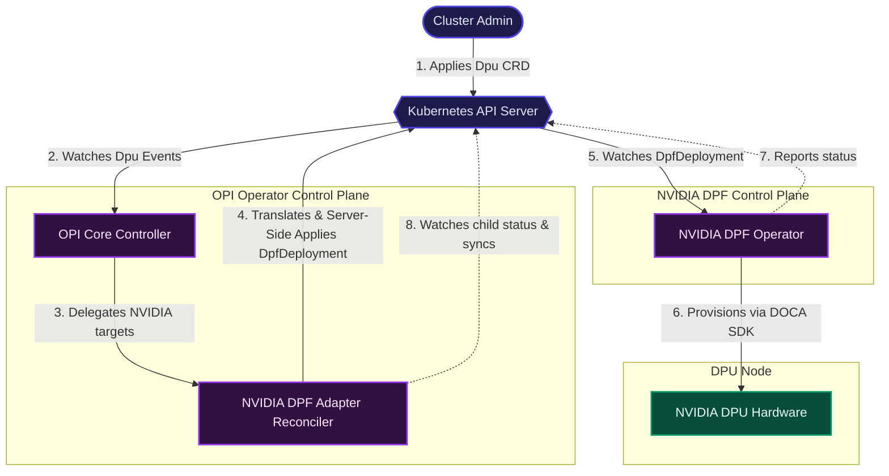
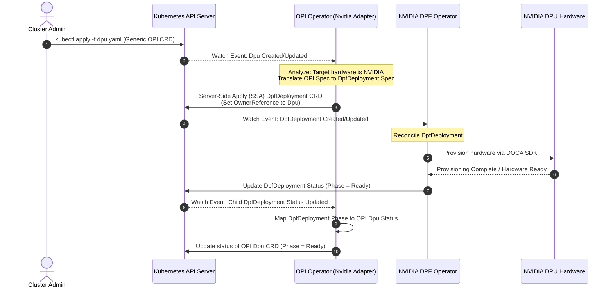
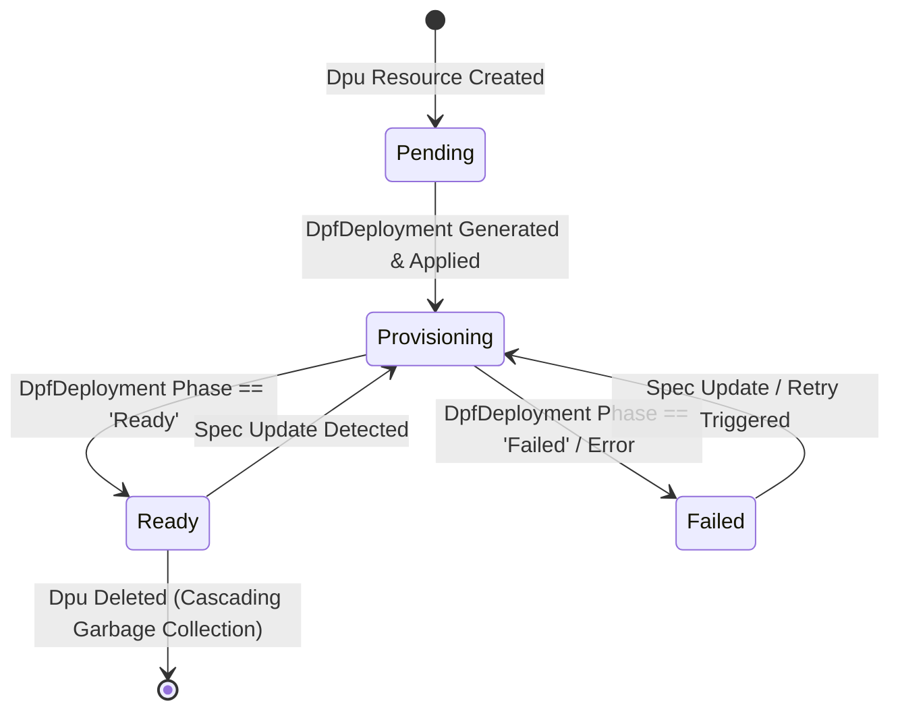

# Architecture Design: NVIDIA DPU Support for OPI DPU Operator

## 1. Executive Summary

This document proposes a highly decoupled, composable architecture to introduce NVIDIA DPU support into the Open Programmable Infrastructure (OPI) ecosystem. By implementing a **Sub-Operator / CRD Translation Architecture**, we fulfill OPI's requirement for a vendor-agnostic unified control plane, while maximizing the reuse of NVIDIA's native DOCA Platform Framework (DPF) Operator. This approach ensures that the core OPI operator remains lightweight, free of vendor-specific SDK bloat, and highly resilient.

---

## 2. Problem Statement & Design Goals

The OPI DPU Operator manages the lifecycle of physical infrastructure processors (DPUs/IPUs) using generic Custom Resource Definitions (CRDs). However, interacting directly with NVIDIA hardware requires specialized knowledge of the DOCA SDK. 

Direct integration presents several challenges:
* **Tightly Coupled Binaries:** Compiling vendor-specific SDKs directly into the open-source OPI operator binary.
* **Dependency Conflicts:** Managing conflicting library versions (e.g., conflicting versions of gRPC or Kubernetes client-go) across multiple hardware vendors (Intel, NVIDIA, Marvell).
* **RBAC Bloat:** Requiring the main OPI operator to hold high-privilege permissions for all vendor-specific operations.
* **Maintenance Burden:** Forcing OPI maintainers to update the core operator whenever a vendor releases a new hardware generation or SDK version.

### Key Design Goals:
1. **Vendor Independence:** Keep the OPI Operator core decoupled from proprietary vendor software.
2. **Kubernetes-Native Composition:** Align with established Kubernetes operator patterns (similar to how `Deployments` compose `ReplicaSets` and `Pods`).
3. **High Reusability:** Leverage NVIDIA's existing DOCA Platform Framework (DPF) operator to manage hardware-level tasks.
4. **Self-Healing & Declarative Control:** Ensure that external modifications or failures in the underlying hardware layer are automatically resolved and surfaced.

---

## 3. Proposed Architecture: Sub-Operator Composition Layer

Rather than communicating with the hardware directly, the OPI operator delegates the hardware lifecycle management to the NVIDIA DPF Operator by acting as a **CRD Translation and Composition Layer**.

### High-Level System Architecture

The following component diagram illustrates the relationship between the Cluster Admin, the Kubernetes API Server, the OPI Operator, the NVIDIA DPF Operator, and the underlying DPU hardware:



---

## 4. Sequential Reconciliation Workflow

The sequence of events from when an administrator applies a generic OPI configuration to hardware provisioning is mapped below:



---

## 5. Detailed API Schema Mapping

To prevent compiling proprietary NVIDIA Go structs directly into the OPI binary, the OPI NVIDIA Adapter uses **dynamic Kubernetes client mechanisms** (`unstructured.Unstructured`). 

### CRD Schema Definitions

#### OPI `Dpu` CRD (Generic representation)
```yaml
apiVersion: opi.github.io/v1alpha1
kind: Dpu
metadata:
  name: dpu-prod-01
  namespace: default
spec:
  image: "nvcr.io/nvidia/doca/doca-os:2.2.0"
  profile: "high-performance-networking"
```

#### Translated NVIDIA `DpfDeployment` CRD
```yaml
apiVersion: dpf.nvidia.com/v1alpha1
kind: DpfDeployment
metadata:
  name: dpu-prod-01-dpf
  namespace: default
  ownerReferences:
    - apiVersion: opi.github.io/v1alpha1
      blockOwnerDeletion: true
      controller: true
      kind: Dpu
      name: dpu-prod-01
      uid: "8f76e73a-4a2a-4df8-b570-76fa4c995eb0"
spec:
  systemImage: "nvcr.io/nvidia/doca/doca-os:2.2.0"
  configurationProfile: "high-performance-networking"
```

### Spec Configuration Mapping Table

| OPI Dpu CRD Field (`spec.*`) | NVIDIA DpfDeployment CRD Field (`spec.*`) | Description |
| :--- | :--- | :--- |
| `image` | `systemImage` | The system OS image containing driver configurations and DOCA libraries. |
| `profile` | `configurationProfile` | Predefined configuration templates (e.g. smartnic, network-offload). |

---

## 6. Reconciliation & State Machine Design

The OPI Dpu controller manages a state machine that reflects the state of the underlying downstream operator.



### Key Lifecycle Implementation Mechanisms

1. **Server-Side Apply (SSA):** 
   The adapter reconciliation loop patches the `DpfDeployment` using Server-Side Apply. This defines `opi-nvidia-adapter` as the field owner, preventing race conditions or accidental field overrides if other cluster components modify the downstream resource.
2. **Cascading Garbage Collection:** 
   By using `ctrl.SetControllerReference()`, the adapter establishes an owner-dependency relationship. When the parent `Dpu` CRD is deleted, Kubernetes automatically schedules the child `DpfDeployment` resource for garbage collection, prompting the DPF Operator to clean up hardware allocations.
3. **Dynamic Watching:** 
   The controller registers an `.Owns()` hook on the `DpfDeployment` unstructured GVK. This triggers the reconciliation loop of the parent `Dpu` resource whenever the status phase of the child `DpfDeployment` changes.

---

## 7. Edge Cases & Resilience Analysis

| Failure Scenario | Impact | Self-Healing / Mitigation Strategy |
| :--- | :--- | :--- |
| **NVIDIA DPF Operator Not Installed** | Reconciler fails to apply child CRD. | The adapter receives a `GroupVersionKind` missing error. The reconciler logs a structured warning, updates the `Dpu` status to `Failed` (Reason: `DpfOperatorMissing`), and schedules a backoff retry. |
| **Manual Modification of `DpfDeployment`** | Downstream spec drift. | Because the adapter watches owned resources, any external modification to `DpfDeployment` triggers a re-reconciliation, correcting the state back to the OPI `Dpu` spec using Server-Side Apply. |
| **Missing Image or Incorrect Profile** | Downstream Operator reports failure. | The DPF operator updates `DpfDeployment` status to `Failed`. The adapter detects this change via resource watch, extracts the error details, and syncs them to the parent `Dpu` status. |
| **API Server Rate Limiting** | Reconciliation timeouts. | The controller-runtime utilizes workqueues with rate limiting. Transient errors trigger exponential backoff retry policies, avoiding API server overload. |

---

## 8. Security & RBAC Model

To maintain a secure cluster configuration, the adapter reconciler operates under strict, minimum-privilege RBAC roles.

| API Group | Resource | Verbs | Rationale |
| :--- | :--- | :--- | :--- |
| `opi.github.io` | `dpus` | `get`, `list`, `watch`, `create`, `update`, `patch`, `delete` | Required to read and update OPI DPU resources. |
| `opi.github.io` | `dpus/status` | `get`, `update`, `patch` | Required to write phase updates to OPI DPU resources. |
| `dpf.nvidia.com` | `dpfdeployments` | `get`, `list`, `watch`, `create`, `update`, `patch`, `delete` | Required to orchestrate lifecycle of downstream NVIDIA resources. |

---

## 9. Comprehensive Trade-off Analysis

To justify the Sub-Operator Composition model, several alternative design paradigms were evaluated:

### CRD Translation Layer (Sub-Operator Composition) 
* **Description:** OPI Operator acts as an API proxy translating configurations into vendor-native CRDs.
* **Score: 9/10**
* **Pros:**
  * Strict separation of concerns (no vendor SDK code in OPI).
  * Outsources complex hardware orchestration and vendor-specific maintenance.
  * Resilient to crashes in vendor-specific code blocks.
* **Cons:**
  * Double Kubernetes resource overhead (requires deployment of both operators).
  * Latency is slightly increased due to extra CRD lifecycle events.

---

## 10. Future Recommendations: Extensible Multi-Vendor Plugin Registration

To scale this architecture to support other vendors (such as Intel or Marvell) in a clean fashion, we recommend:
1. **Dynamic Registration Interface:** Define a standard Go `VendorAdapter` interface inside the OPI Operator.
2. **Modular Controller Loading:** Build the OPI Operator in a modular fashion where vendor-specific controllers register themselves during startup.
3. **Plug-and-Play Deployments:** Allow users to enable or disable vendor controllers using Helm chart values, reducing the runtime footprint to only the hardware present in the cluster.
=======
## 5. Implementation Considerations
- **Garbage Collection:** The OPI Operator must set `OwnerReferences` on the translated DPF CRDs. If a cluster administrator deletes the OPI DPU resource, Kubernetes will automatically cascade the deletion to the DPF CRD.
- **Server-Side Apply (SSA):** The translation layer should use SSA to ensure clear declarative field ownership, avoiding race conditions where the translation layer and the DPF operator overwrite each other’s fields.

## 6. Current Implementation Status
The current Go skeleton implements the recommended architecture as a translation adapter:
- Uses a generic `VendorAdapter` interface to isolate vendor-specific details.
- Implements `NvidiaTranslator` for NVIDIA DPF CRD generation.
- Uses a `VendorRegistry` to route reconciliation based on `spec.vendor` in the OPI `Dpu` resource.
- Applies translated `DpfDeployment` CRs using Server-Side Apply and owner references.
- Syncs the vendor CR status back into the OPI `Dpu` status field.

### Notes on DOCA Usage
This skeleton intentionally avoids importing the NVIDIA DOCA SDK directly. Instead, it translates generic OPI intent into native NVIDIA DPF CRs and relies on the NVIDIA DPF operator to perform the DOCA-based hardware provisioning. This keeps the core OPI operator vendor-agnostic and extensible for future AMD or alternative vendor adapters.

### Future Extension Path
To extend for AMD support, add a new translator implementation such as `AMDTranslator`:
- Implement `Translate()` to create AMD-specific CRDs.
- Implement `OwnedGVK()` to return the AMD CRD GVK.
- Register the adapter in `VendorRegistry{"amd": &AMDTranslator{}}`.

This preserves the adapter pattern while allowing multi-vendor reconciliation without recompiling the reconciler logic.

